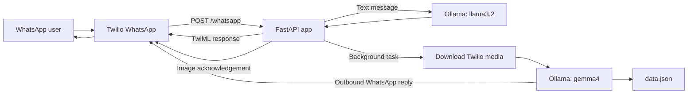

# WhatsApp Health & Food Assistant

A Python chatbot that lets a person ask basic health and wellness questions over
WhatsApp, view sample wearable information, keep a lightweight food log, and
submit food photos for local AI analysis. Twilio delivers messages, FastAPI
handles its webhook, and Ollama runs the language and vision models locally.


## At a glance

- Receive WhatsApp text and image messages through a Twilio webhook.
- Generate concise text replies with a local Ollama language model.
- Download Twilio-hosted image media and analyze it with a local vision model.
- Keep per-sender chat history, food entries, and pending food confirmations
  in a JSON file.
- Keep inference local rather than sending prompts and images to a hosted model
  API.

## How it works



### Message flows

**Text:** FastAPI reads the incoming sender and body, calls `llama3.2`, and
returns the answer in a TwiML `<Message>` response to Twilio. This path does not
use a Twilio Content SID or make a separate outbound send request.

**Image:** FastAPI returns an acknowledgement and queues image processing as a
background task. The task downloads the image using the Twilio credentials,
passes its bytes to `gemma4`, saves the result and pending food confirmation,
then sends a new WhatsApp message through the Twilio REST API. Twilio error
`21654` currently prevents that last step for this account unless an approved
WhatsApp Content Template is configured.

## Technology stack

| Area | Technology |
| --- | --- |
| Language | Python |
| Web framework and request handling | FastAPI, Starlette |
| ASGI server | Uvicorn |
| WhatsApp integration | Twilio WhatsApp, Twilio Python SDK, TwiML |
| Local model runtime | Ollama |
| Text model | `llama3.2` |
| Image model | `gemma4` |
| HTTP media download | HTTPX |
| Form parsing and configuration | `python-multipart`, `python-dotenv` |
| Persistence | JSON file (`data.json`) |

The project also lists `google-genai`, `openai`, and `Pillow` in
`requirements.txt`; the current request and inference paths use Ollama.

## Folder structure

```text
Noise_Task_1/
├── app.py             # FastAPI app, Twilio webhook, TwiML and outbound replies
├── gemini.py          # Ollama prompts, media download, user data and chat logic
├── data.json          # Per-sender profiles, wearable sample data, logs and state
├── requirements.txt   # Python dependencies
├── README.md          # Project overview and setup instructions
├── .env               # Local credentials; create locally and never publish
└── __pycache__/       # Generated Python bytecode; not application source
```

The filename `gemini.py` is historical: the current implementation imports and
calls Ollama models; it does not call the Gemini API.

## Set up your own instance

### 1. Install prerequisites

- Python 3.10 or later
- Ollama installed and running
- A Twilio account with WhatsApp messaging enabled (the WhatsApp Sandbox is
  suitable for development)

Pull the models used by the code:

```powershell
ollama pull llama3.2
ollama pull gemma4
ollama list
```

### 2. Install Python dependencies

From the project folder:

```powershell
python -m pip install -r requirements.txt
```

### 3. Configure environment variables

Create a `.env` file in the project folder. Add your own values; do not commit
this file or share its credentials.

```dotenv
TWILIO_ACCOUNT_SID=AC................................
TWILIO_AUTH_TOKEN=your_twilio_auth_token
TWILIO_PHONE_NUMBER=+1..................

# Optional: approved WhatsApp Content Template SID, beginning with HX.
# The template must contain a {{1}} variable for the generated response.
# TWILIO_CONTENT_SID=HX................................
```

`TWILIO_PHONE_NUMBER` is the Twilio sender in E.164 format, without the
`whatsapp:` prefix. The optional template SID is only used for the asynchronous
image-result message; text replies do not need it.

### 4. Connect the WhatsApp webhook

Start the application:

```powershell
python -m uvicorn app:app --host 0.0.0.0 --port 8000
```

Expose the local server through a public HTTPS tunnel during development, or
deploy it to a server with a public HTTPS URL. In the Twilio WhatsApp Sandbox
configuration, set the **When a message comes in** webhook to:

```text
https://<your-public-host>/whatsapp
```

Use `POST` for the webhook method. Join the Sandbox from the WhatsApp phone
you'll use for testing. Keep the terminal open and inspect its logs while
sending a message.

### 5. Try it

- Send a text question about steps, sleep, heart rate, or food logging.
- Send a food photo to exercise the image path.
- Confirm the image-generated food details in a follow-up message to add them
  to the food log.

The home route can be used as a basic process check:

```text
GET /
```

It returns a JSON status response. The WhatsApp webhook is available at
`POST /whatsapp` (the app also accepts `GET` for manual development checks).

## Configuration reference

| Variable | Required | Purpose |
| --- | --- | --- |
| `TWILIO_ACCOUNT_SID` | Yes | Authenticates Twilio API calls and media downloads. |
| `TWILIO_AUTH_TOKEN` | Yes | Authenticates Twilio API calls and media downloads. |
| `TWILIO_PHONE_NUMBER` | Yes | WhatsApp-enabled Twilio sender number in E.164 format. |


## Data and behavior

`data.json` is read and written beside `gemini.py`, independent of the current
working directory. User records are keyed by the sender's phone number and can
contain:

- A profile and sample wearable readings
- A food log
- A recent chat history used as text-model context
- A pending food confirmation from image analysis

New user profiles currently use sample values defined in `gemini.py`; this
prototype does not provide profile onboarding or a database migration system.

## Known limitations and production considerations

- **Image-result delivery:** This account returned Twilio error `21654` for the
  separate outbound image-analysis reply. The Content API also reported that
  it is unavailable on the account's Trial plan. A working template requires
  Content Template access, a WhatsApp-approved template, and its `HX...` SID in
  `TWILIO_CONTENT_SID`. Account upgrades or feature access must be handled in
  Twilio Console.
- **Text webhook duration:** Text generation runs before the webhook response
  is returned. It worked with the local text model during development, but a
  slow model or network could exceed Twilio's webhook timeout.
- **Background task durability:** FastAPI background tasks are in-process and
  are not a persistent job queue; a server restart can interrupt image work.
- **Persistence and concurrency:** JSON storage is suitable for a small demo,
  not concurrent production traffic, multiple app workers, or large histories.
- **Webhook security:** Configure public HTTPS. Add Twilio request-signature
  validation before exposing this endpoint to untrusted traffic.
- **Health information:** Responses are intended to be informational, not
  diagnosis or treatment. Do not use this prototype for emergencies or as a
  substitute for professional care.
- **Local model output:** Image results depend on the installed model version
  and hardware and should be checked rather than treated as precise nutrition
  or portion measurements.

## Testing

No automated test suite is currently included. The webhook text/image paths,
Twilio request shapes, Python compilation, and local model calls have been
checked manually during development. Real WhatsApp delivery depends on the
Twilio account, sender setup, Sandbox membership, template approval, and public
webhook availability.
